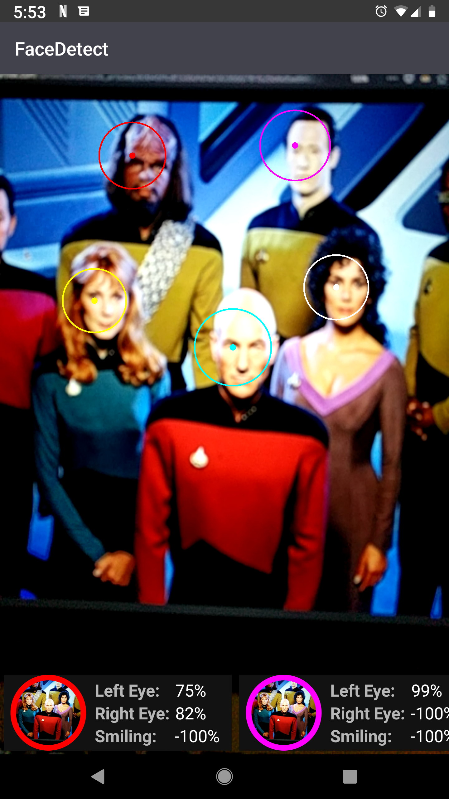
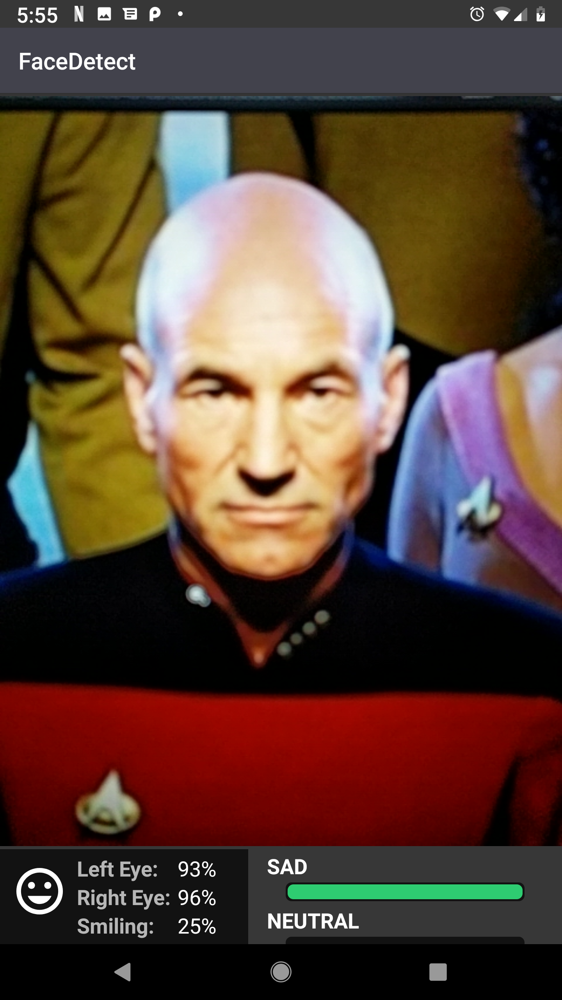
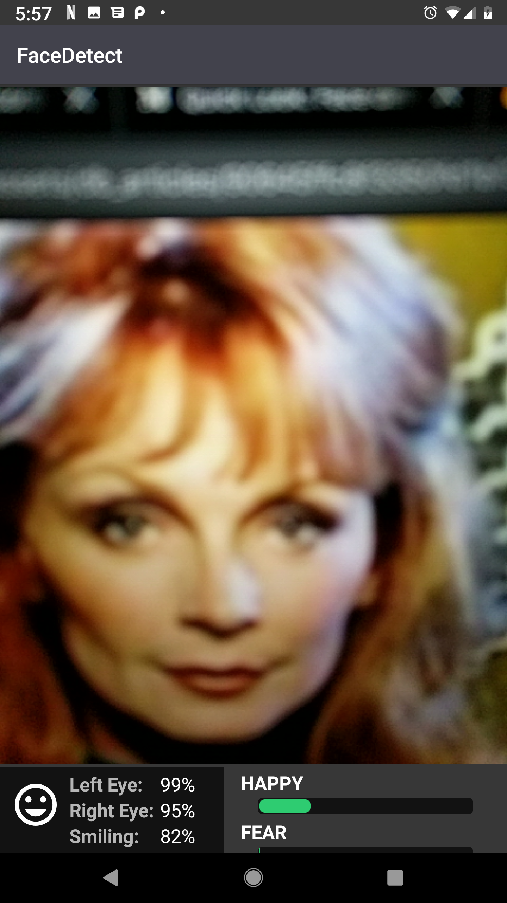

# FaceDetect
Android app that uses Firebase's ML Kit to detect faces and then can also provide
emotion predictions by using a custom trained model.

More information about the ML Kit's implementation can be found in [this article](https://medium.com/rocket-fuel/quick-look-face-detection-on-android-using-ml-kit-7041de41df4c) I wrote going over ML Kit's face detection.


### Note when running the for the first time
* ML Kit downloads the model for local inference the first time you use it
  * After running for the first time (after enabling permissions) you may have to wait some time
* Handling permissions have not been handled yet
  * Current Workaround: enable permissions for the app in the Android OS settings
* Emotion Recognition is pointing to a local server using ngrok
  * You would need to set your own instance and change url

## ML Kit's Face Detector
Wraps the `FiresbaseVisionFaceDetector` from the new `ml.vision` package in a `Detector` object from the
 old `gms.vision` package so we can use the `CameraSource` and capture a controlled stream of frames and predictions.



 ## Custom Emotion Detection
 

 You can setup an instance of a server like I have [here](https://github.com/JsFlo/EmotionRecServer) and update the static variable in the `RetrofitNetwork.kt` file.

 ```java
 val BASE_URL = "https://xxxxxx.ngrok.io"
 ```
*I use [ngrok](https://ngrok.com/) to expose the endpoints running from a local server*
